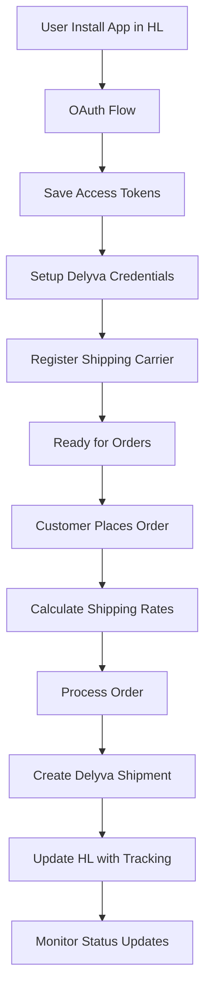

# 🚀 GoHL Delyva Integration

[](https://laravel.com)
[](https://reactjs.org)
[](https://www.typescriptlang.org)
[](LICENSE)

> **Premium Laravel plugin for seamless integration between HighLevel and Delyva shipping services.**

## 📋 Table of Contents

- [About the Project](#-about-the-project)
- [Key Features](#-key-features)
- [Technology Stack](#-technology-stack)
- [Setup & Installation](#-setup--installation)
- [Configuration](#-configuration)
- [Development](#-development)
- [API Documentation](#-api-documentation)
- [Deployment](#-deployment)
- [Testing](#-testing)
- [Contributing](#-contributing)
- [License](#-license)

## 🎯 About the Project

**GoHL Delyva Integration** is a powerful Laravel plugin for integrating HighLevel platform with Delyva API, enabling automatic shipping management and fulfillment for eCommerce businesses.

### 🎪 Live Demo
- **Frontend Demo**: [https://demo.delyva-integration.com](https://demo.delyva-integration.com)
- **HighLevel Marketplace**: Coming Soon 🔜

## ✨ Key Features

### 🔄 **HighLevel Integration**
- ✅ OAuth 2.0 authentication with HighLevel
- ✅ Automatic carrier registration
- ✅ Real-time shipping rates calculation
- ✅ Order webhook processing
- ✅ Fulfillment tracking updates

### 🚚 **Delyva Integration** 
- ✅ Multiple courier support (J&T, Pos Laju, DHL, etc.)
- ✅ Instant shipping quotes
- ✅ Real-time order tracking
- ✅ Automatic status synchronization
- ✅ Webhook notifications

### 🎨 **Modern Frontend**
- ✅ React 18 with TypeScript
- ✅ Tailwind CSS for styling
- ✅ Responsive design
- ✅ Real-time validation
- ✅ HighLevel iframe compatible

### 🔒 **Security & Performance**
- ✅ Token-based authentication
- ✅ Webhook signature validation
- ✅ Automatic token refresh
- ✅ Error handling & logging
- ✅ Input sanitization

## 🛠 Technology Stack

### Backend
- **Framework**: Laravel 11.x
- **Database**: MySQL/PostgreSQL
- **API**: RESTful with JSON
- **Authentication**: OAuth 2.0
- **Queue**: Laravel Queues

### Frontend
- **Framework**: React 18.x
- **Language**: TypeScript 5.x
- **Styling**: Tailwind CSS
- **Build Tool**: Vite
- **State Management**: React Hooks

### Infrastructure
- **Server**: PHP 8.2+
- **Web Server**: Apache/Nginx
- **SSL**: Required (HTTPS)
- **Hosting**: Cloud compatible

## 🚀 Setup & Installation

### System Requirements
- PHP 8.2 or higher
- Composer 2.x
- Node.js 18+ & npm
- MySQL 5.7+ or PostgreSQL 10+
- SSL Certificate (for production)

### 1. Clone Repository
```bash
git clone https://github.com/yourusername/gohl-delyva.git
cd gohl-delyva
```

### 2. Install Dependencies
```bash
# Backend dependencies
composer install

# Frontend dependencies
npm install
```

### 3. Environment Setup
```bash
# Copy environment file
cp .env.example .env

# Generate application key
php artisan key:generate

# Create database file (for SQLite)
touch database/database.sqlite
```

### 4. Database Migration
```bash
# Run migrations
php artisan migrate

# (Optional) Seed sample data
php artisan db:seed
```

### 5. Build Assets
```bash
# Development build
npm run dev

# Production build
npm run build
```

### 6. Start Development Server
```bash
# Option 1: Laravel built-in server
php artisan serve

# Option 2: Use Laravel Sail (Docker)
./vendor/bin/sail up

# Option 3: Use automated script
npm run dev
```

## ⚙️ Configuration

### Environment Variables

Add the following configuration to your `.env` file:

```env
# HighLevel Configuration
HIGHLEVEL_CLIENT_ID=your_highlevel_client_id
HIGHLEVEL_CLIENT_SECRET=your_highlevel_client_secret
HIGHLEVEL_REDIRECT_URI=https://yourdomain.com/oauth/callback
HIGHLEVEL_BASE_URL=https://services.leadconnectorhq.com
HIGHLEVEL_SHARED_SECRET=your_shared_secret

# Delyva Configuration
DELYVA_BASE_URL=https://api.delyva.app
DELYVA_WEBHOOK_SECRET=your_delyva_webhook_secret

# Application
APP_URL=https://yourdomain.com
APP_ENV=production
APP_DEBUG=false

# Database
DB_CONNECTION=mysql
DB_HOST=127.0.0.1
DB_PORT=3306
DB_DATABASE=delyva_integration
DB_USERNAME=your_db_user
DB_PASSWORD=your_db_password
```

### HighLevel App Configuration

Setup in HighLevel Marketplace:

```json
{
  "oauth_callback": "https://yourdomain.com/oauth/callback",
  "plugin_page": "https://yourdomain.com/plugin-page",
  "order_webhook": "https://yourdomain.com/api/webhooks/highlevel",
  "rates_callback": "https://yourdomain.com/api/shipping/rates/callback",
  "scopes": [
    "locations.readonly",
    "orders.readonly", 
    "orders.write",
    "payments.readonly",
    "payments.write"
  ]
}
```

## 💻 Development

### Development with Ngrok

For development and testing with HighLevel:

```bash
# Install ngrok
npm install -g ngrok

# Start Laravel server
php artisan serve

# Start ngrok (terminal baru)
ngrok http 8000

# Automated script (Windows)
start-ngrok.bat

# Automated script (Linux/Mac)
./start-ngrok.sh
```

### Available Scripts

```bash
# Development
npm run dev                 # Start development server
npm run build              # Build for production
npm run watch              # Watch for changes

# Laravel
php artisan serve          # Start Laravel server
php artisan migrate        # Run migrations
php artisan queue:work     # Start queue worker

# Testing
npm run test              # Run frontend tests
php artisan test          # Run Laravel tests
```

## 📚 API Documentation

### Authentication Endpoints

| Method | Endpoint | Description |
|--------|----------|-------------|
| `GET` | `/oauth/highlevel/redirect` | Redirect to HighLevel OAuth |
| `GET` | `/oauth/callback` | Handle OAuth callback |
| `POST` | `/oauth/highlevel/refresh/{locationId}` | Refresh access token |

### Credentials Management

| Method | Endpoint | Description |
|--------|----------|-------------|
| `POST` | `/api/credentials` | Save Delyva credentials |
| `POST` | `/api/credentials/test` | Test credentials |
| `GET` | `/delyva/credentials/{locationId}` | Get credentials |
| `DELETE` | `/delyva/credentials/{locationId}` | Delete credentials |

### Shipping & Orders

| Method | Endpoint | Description |
|--------|----------|-------------|
| `POST` | `/shipping/rates/callback` | Handle rates request |
| `POST` | `/webhooks/orders` | Process order webhook |
| `POST` | `/carrier/register/{locationId}` | Register carrier |
| `GET` | `/tracking/info/{locationId}/{orderId}` | Get tracking info |

### Sample API Calls

#### Save Delyva Credentials
```bash
curl -X POST https://yourdomain.com/api/credentials \
  -H "Content-Type: application/json" \
  -d '{
    "locationId": "hl_location_123",
    "apiKey": "delyva_api_key",
    "customerId": "delyva_customer_id"
  }'
```

#### Test Credentials
```bash
curl -X POST https://yourdomain.com/api/credentials/test \
  -H "Content-Type: application/json" \
  -d '{
    "apiKey": "your_delyva_api_key",
    "customerId": "your_customer_id"
  }'
```

## 🚀 Deployment

### Production Deployment (cPanel/Hostinger)

1. **Upload Files**:
```bash
# Upload all Laravel files to app/ folder
# Upload contents of public/ folder to public_html/
```

2. **Edit index.php**:
```php
// Update paths in public_html/index.php
require __DIR__.'/app/vendor/autoload.php';
$app = require_once __DIR__.'/app/bootstrap/app.php';
```

3. **Setup Database**:
```bash
# Create database in cPanel
# Update .env with database credentials
# Run migrations via SSH or file manager
php artisan migrate --force
```

4. **Set Permissions**:
```bash
chmod -R 755 app/storage
chmod -R 755 app/bootstrap/cache
```

## 🧪 Testing

### Manual Testing

```bash
# Test plugin page
curl -I https://yourdomain.com/plugin-page

# Test OAuth callback
curl -I https://yourdomain.com/oauth/callback

# Test API endpoints
curl -X POST https://yourdomain.com/api/test-context \
  -H "Content-Type: application/json" \
  -d '{"locationId": "test123"}'
```

### HighLevel Integration Testing

1. Setup ngrok for development
2. Configure HighLevel app with ngrok URL
3. Test OAuth flow in HighLevel
4. Verify webhook processing
5. Test shipping rates calculation

## 📊 Flow Diagram



## 🤝 Contributing

We greatly appreciate contributions from the community! 

### Development Guidelines
1. Fork this repository
2. Create feature branch (`git checkout -b feature/amazing-feature`)
3. Commit changes (`git commit -m 'Add amazing feature'`)
4. Push to branch (`git push origin feature/amazing-feature`)
5. Create Pull Request

### Code Standards
- Follow PSR-12 for PHP code
- Use ESLint for JavaScript/TypeScript
- Write comprehensive tests
- Update documentation

## 📞 Support & Community

- **Documentation**: [Wiki Pages](https://github.com/yourusername/gohl-delyva/wiki)
- **Issues**: [GitHub Issues](https://github.com/yourusername/gohl-delyva/issues)
- **Discussions**: [GitHub Discussions](https://github.com/yourusername/gohl-delyva/discussions)
- **Email**: support@yourcompany.com

## 📄 License

This project is licensed under the [MIT License](LICENSE).

---

<div align="center">

**⭐ If this project helps you, please give it a star on GitHub!**

[⭐ Star on GitHub](https://github.com/yourusername/gohl-delyva) • [🐛 Report Bug](https://github.com/yourusername/gohl-delyva/issues) • [💡 Request Feature](https://github.com/yourusername/gohl-delyva/issues)

</div>
